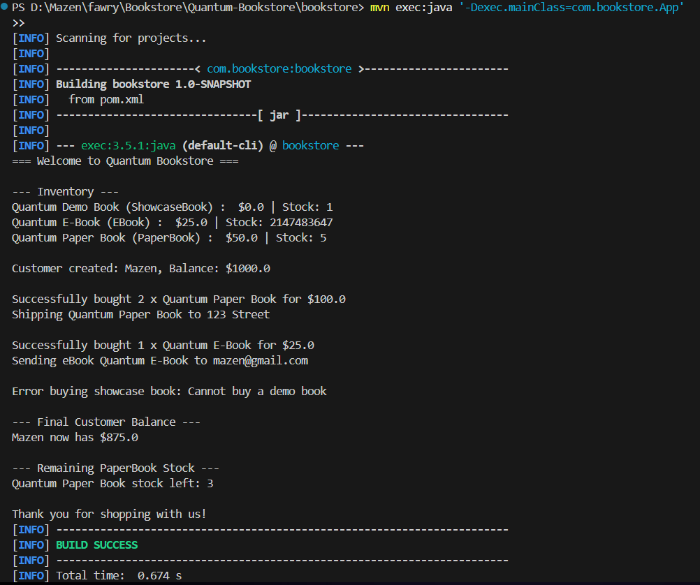

# Quantum Bookstore

Welcome to **Quantum Bookstore**, a demo Java application simulating an advanced bookstore with different book types and customer purchasing logic.

---

##  Features

- Supports **three types of books**:
  - Paper books (with stock & ShippingService)
  - EBooks (sent via email)
  - Showcase books (demo only, not for sale)
- Customer creation and balance management
- Inventory stock management
- Shipping and email services
- Exception handling for invalid operations

---

## Technologies used

- Java (17 or above)
- Maven
- Object-oriented design 
- VS Code 

---


##  How it works
1- Inventory initialized with three book types.

2- A customer is created with an initial balance.

3- Customer buys paper book, stock decreases, and shipping message appears.

4- Customer buys eBook, email is sent.

5- Attempt to buy a showcase book → correctly throws an error.

6- Final balance and stock levels are printed.

## Sample Output




```
=== Welcome to Quantum Bookstore ===

--- Inventory ---
Quantum Demo Book (ShowcaseBook) :  $0.0 | Stock: 1
Quantum Paper Book (PaperBook) :  $50.0 | Stock: 5
Quantum E-Book (EBook) :  $25.0 | Stock: 2147483647

Customer created: Mazen, Balance: $1000.0

Successfully bought 2 x Quantum Paper Book for $100.0
Shipping Quantum Paper Book to 123 Street

Successfully bought 1 x Quantum E-Book for $25.0
Sending eBook Quantum E-Book to mazen@gmail.com

Error buying showcase book: Cannot buy a demo book

--- Final Customer Balance ---
Mazen now has $875.0

--- Remaining PaperBook Stock ---
Quantum Paper Book stock left: 3

Thank you for shopping with us!
```

## How to Run
- Navigate to \Bookstore\Quantum-Bookstore\bookstore> then excute the following code in powershell:
  
```pwsh
mvn clean compile
mvn exec:java '-Dexec.mainClass=com.bookstore.App'
```

